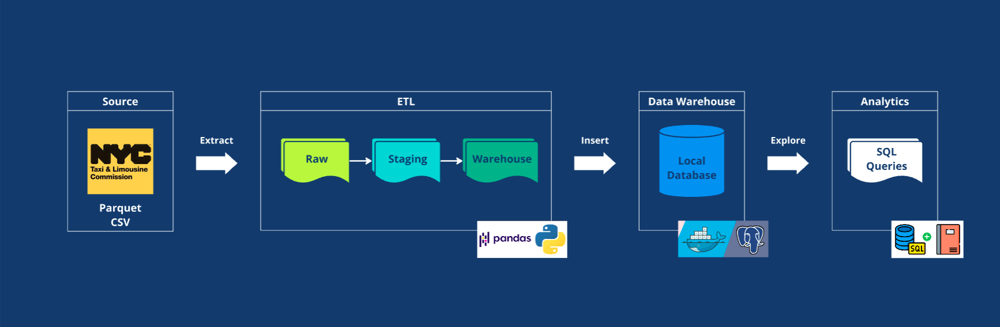
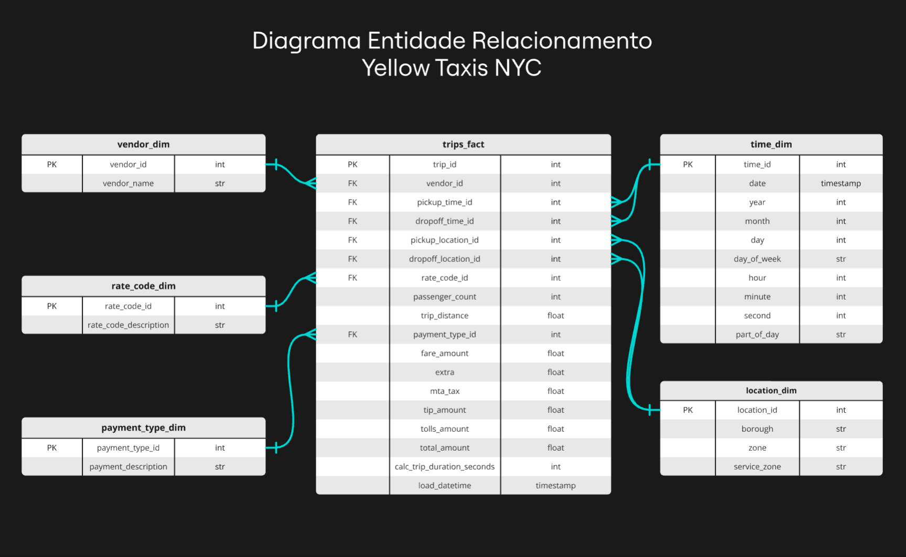

# NYC Yellow Taxi Trip Records com Data Warehouse

## Objetivo do Projeto

O projeto busca desenvolver análises SQL sobre os dados de corridas de táxis amarelos em Nova York durante janeiro de 2024, visando monitorar KPIs e gerar insights úteis para a gestão desse tipo de transporte. Os dados são organizados em um Data Warehouse local para facilitar consultas e análises.

## Estrutura do Projeto

O pipeline automatiza o processamento de dados de corridas de táxi, transformando informações brutas em um formato limpo, estruturado e pronto para análises. Ele é projetado para ser eficiente e escalável, com etapas modulares que garantem a integridade dos dados em cada fase.



Esse pipeline segue a abordagem ETL (Extração, Transformação e Carga) para processar dados (com Pandas) sobre corridas de táxi e armazená-los em um Data Warehouse local provisionado em Docker (para saber mais sobre o provisionamento de databases local com Docker acesse o [Projeto Postgres com Docker](https://github.com/oliveira-bs/postgresql_docker.git)). Abaixo, descrevemos o fluxo de forma objetiva:

1. Extração (Ingestão de Dados)

   - Responsável: ingest.py
   - Descrição:
       - Este módulo baixa os dados brutos da fonte (neste caso, o site oficial da NYC Taxi and Limousine Commission) e armazena no diretório `data/raw/`.
       - O formato dos dados pode variar entre CSV e Parquet, dependendo da configuração.
       - Ações Importantes:
           - Verificação de integridade dos arquivos.
           - Extração de múltiplos arquivos (separados por mês/ano; Nesse projeto: 01/2024).

2. Transformação (Limpeza e Normalização)

   - Responsável: process.py e transform.py
   - Descrição:

      - Processamento (process.py):
         - Os dados brutos são carregados do diretório `data/raw/` para o diretório intermediário `data/staging/`.
         - Esta etapa inclui limpeza e normalização:
               - Remoção de registros inválidos:
                  - Viagens com valores negativos (distância ou tarifas).
                  - Registros com coordenadas inválidas ou faltando.
                  - Corridas sem passageiros.
                  - Datas invalidas para o período
               - Tratamento de valores nulos:
                  - Substituição por valores padrão (se possível) ou exclusão de registros.
               - Conversão de tipos:
                  - Ajuste dos formatos de data e hora.
                  - Conversão de colunas numéricas para evitar inconsistências.
  

      - Transformação e Carga (transform.py):
          - Os dados são organizados de acordo com o modelo dimensional (estrela).
          - As tabelas dimensionais são populadas primeiro:
              - Dimensionamento de locais: Tabelas de pickup_location e dropoff_location baseadas em IDs únicos.
              - Dimensionamento temporal: Extração de informações como ano, mês, dia, e hora das colunas de data/hora.
          - A tabela fato é gerada por meio de join entre as dimensões e os dados processados.
          - Os resultados finais são gravados no diretório `data/warehouse/`.

3. Carga (Persistência no Data Warehouse)

   -Responsável: database.py
   -Descrição:
      -Conexão a um banco de dados provisionado no Docker.
      -Banco de Dados Local no Docker:
         -O Data Warehouse é um banco relacional (PostgreSQL ou outro especificado).
         -O script cria tabelas de acordo com o esquema definido em sql/schema.sql.
         -Dados do diretório `data/warehouse/` são inseridos no banco.


O projeto apresenta a seguinte organização:

1. Dados: Repositórios separados para dados brutos, intermediários (staging) e finais (Data Warehouse).
2. Módulos: Scripts modulares para ingestão, processamento e carga.
3. SQL e Notebooks: Scripts de consultas e notebooks para análises exploratórias.

```
NYC_Yellow_Taxi_Trip_Records/
├── config/                 # Configurações do projeto
│   ├── schema.json         # Esquema do Data Warehouse
│   ├── database_config.py  # Configurações do banco de dados
├── data/                   # Dados brutos, processados e do Data Warehouse
│   ├── raw/                # Dados brutos (CSV e Parquet)
│   ├── staging/            # Dados processados
│   └── warehouse/          # Dados finais organizados
├── notebook/               # Análises exploratórias em notebooks
│   └── analytics.ipynb     # Notebook para análises
├── modules/                # Módulos para ETL
│   ├── ingest.py           # Ingestão de dados
│   ├── process.py          # Processamento de dados
│   ├── transform.py        # Transformações e carga no Data Warehouse
│   └── database.py         # Conexão e operações com o banco de dados
├── sql/                    # Consultas e esquemas SQL
│   └── schema.sql          # Definição do esquema do banco
├── main.py                 # Ponto de entrada do projeto
├── requirements.txt        # Dependências do projeto
└── .gitignore              # Arquivos ignorados pelo Git
```

## Descrição do Data Warehouse

O Data Warehouse organiza os dados em tabelas dimensionais e uma tabela fato, facilitando análises complexas. As tabelas incluem:

- `time_dim`: Informações temporais das corridas.
- `location_dim`: Localizações de início e fim das corridas.
- `vendor_dim`: Detalhes sobre os fornecedores de serviços.
- `rate_code_dim`: Tipos de tarifas aplicadas.
- `payment_type_dim`: Métodos de pagamento utilizados.
- `trips_fact`: Informações factuais das corridas, conectando todas as dimensões.

### Modelo Estrela

O Data Warehouse adota um modelo estrela, com:

- Fato: Registros de corridas (trips_fact) contendo métricas como valores e tempos.
- Dimensões: Informações categóricas (tempo, localização, fornecedor, etc.).

**Benefícios**: Melhor desempenho para consultas agregadas e flexibilidade analítica.

Abaixo, estão as descrições das tabelas e suas chaves:

1. Tabela Fato: trips_fact

   - Descrição: Contém os dados principais de cada corrida de táxi, incluindo métricas como receita, distância e tempo de viagem.
   
   | Colunas | Tipo | Descrição |
   |-|-|-|
   | trip_id | Chave Primária | Identificador único para cada corrida |
   | vendor_id | Chave Estrangeira | Identificador relacionado a tabela de fornecedores. |
   | pickup_datetime |  | Data e hora do início da corrida |
   | dropoff_datetime |  | Data e hora do término da corrida |
   | pickup_location_id | Chave Estrangeira | Referência para a localização de embarque |
   | dropoff_location_id |  Chave Estrangeira | Referência para a localização de desembarque |
   | rate_code_id | Chave Estrangeira | Referência para o tipo de tarifa aplicada |
   | passenger_count |  | Número de passageiros na corrida |
   | trip_distance |  | Distância total percorrida (milhas) |
   | payment_type_id | Chave Estrangeira | Referência para o método de pagamento |
   | fare_amount |  | Valor da tarifa |
   | extra |  | Valores extras (ex.: taxa de pico) |
   | mta_tax |  | Taxa do MTA (Metropolitan Transportation Authority) |
   | tip_amount |  | Gorjeta |
   | tolls_amount |  | Pedágios |
   | total_amount |  | Valor total da corrida (incluindo taxas e gorjetas) |
   | calc_trip_duration_seconds |  | Calculo d tempo total da viagem em segundos |
   | load_datetime |  | Data e hora da ingestão do registro |

   


2. Dimensão: location_dim

   - Descrição: Define os locais de embarque e desembarque (baseado em IDs únicos).
  
   | Colunas | Tipo | Descrição |
   |-|-|-|
   | location_id | Chave Primária | Identificador único da localização |
   | borough |  | Bairro da localização |
   | zone |  | Nome da zona |
   | service_zone |  | Zona de serviço |

3. Dimensão: rate_code_dim

   - Descrição: Define os tipos de tarifa.

   | Colunas | Tipo | Descrição |
   |-|-|-|
   | rate_code_id | Chave Primária | Identificador único do tipo de tarifa |
   | rate_code_description |  | Nome ou descrição do tipo de tarifa |

4. Dimensão: payment_type_dim

   - Descrição: Define os métodos de pagamento aceitos.

   | Colunas | Tipo | Descrição |
   |-|-|-|
   | payment_type_id | Chave Primária | Identificador único do método de pagamento |
   | payment_description |  | Nome ou descrição do método de pagamento (e.g., dinheiro, cartão) |

5. Dimensão: time_dim

   - Descrição: Fornece informações temporais detalhadas sobre as datas e horários das corridas.

   | Colunas | Tipo | Descrição |
   |-|-|-|
   | time_id | Chave Primária | Identificador único para cada registro de tempo |
   | date | | Representa a data completa no formato YYYY-MM-DD |
   | year | | O ano da data |
   | month | |  O mês da data, representado como um número de 1 (janeiro) a 12 (dezembro) |
   | day | | O dia do mês da data, variando de 1 a 31 |
   | day_of_week | | Nome do dia da semana (ex.: Segunda-feira, Terça-feira (em inglês)) |
   | hour | | A hora do dia, variando de 0 a 23 |
   | minute | | O minuto da hora, variando de 0 a 59 |
   | second | | O segundo da hora, variando de 0 a 59|
   | part_of_day | | Periodo do dia, representado em ingles por: 'Morning', 'Afternoon', 'Evening' e 'Night' |


## Modelagem dos Dados

O modelo segue uma abordagem estrela, com uma tabela fato (`trips_fact`) centralizada e conectada às tabelas dimensionais (`time_dim`, `location_dim`, etc.). Isso permite realizar consultas otimizadas para análises de desempenho.



## KPIs e Insights Relevantes

### KPIs para Monitoramento:
- Receita média por corrida e por dia.
- Distância média percorrida por corrida.
- Taxa de ocupação média (número de passageiros por corrida).
- Tempo médio de corrida.
- Proporção dos métodos de pagamento.

### Insights para Gestão:
- Identificar períodos de alta e baixa demanda.
- Determinar os locais mais populares para embarque e desembarque.
- Analisar a sazonalidade no uso dos táxis.

## Consultas SQL

As consultas SQL para os KPIs e insights estão disponíveis em [notebook/analytics.ipynb](/notebook/analytics.ipynb) e fazem uso de:
- **Joins** para conectar tabelas dimensionais à tabela fato.
- **Window Functions** para calcular médias móveis e percentuais acumulados.
- **CTEs** (Common Table Expressions) para organizar subconsultas.

## Melhorias e Escalabilidade

Para escalar a ingestão de dados e otimizar o projeto, as seguintes melhorias podem ser implementadas:

1. **Automatização de Processos**:
   - Agendar a ingestão e processamento de dados com ferramentas como Apache Airflow.

2. **Persistência na Nuvem**:
   - Migrar o Data Warehouse para uma solução em nuvem, como Google BigQuery ou Amazon Redshift.

3. **Otimização de Consultas**:
   - Utilizar índices e partições no banco de dados para acelerar as consultas.

4. **Integração de BI**: 
   - Conectar o Data Warehouse a ferramentas como Tableau/Power BI.

5. **Monitoramento e Alertas**:
   - Configurar sistemas de monitoramento para acompanhar o desempenho das análises e os processos ETL.

---

**Fonte dos Dados**: [NYC Taxi & Limousine Commission](https://www.nyc.gov/site/tlc/about/tlc-trip-record-data.page)

